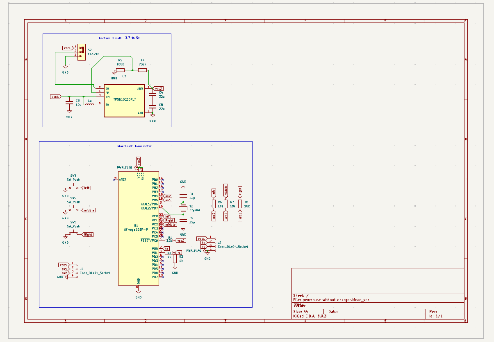
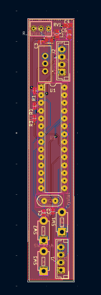

# 🖊️ Pen Mouse – A Wireless Pen-Style Mouse using ATmega328P

The **Pen Mouse** is a compact, pen-like input device that functions similarly to a traditional mouse. It uses an optical sensor to detect movement and buttons for left/right click functionality. Built using affordable and widely available components, this device is ideal for students, designers, and users with limited desk space—particularly during presentations or graphic design work.

---

## ✨ Features

- Move the cursor and perform clicks
- Pen-like ergonomic design for precise control
- Communicates wirelessly via Bluetooth
- Rechargeable and portable

---

## 🔩 Components Selection

- **ATmega328P-PU Microcontroller**  
  8-bit AVR RISC-based MCU with DIP-28 package for easy prototyping. Offers sufficient I/O, memory, and Arduino compatibility.

- **HC-06 Bluetooth Module (4-pin)**  
  Provides wireless connectivity. Simple UART interface, works with 3.3V or 5V logic.

- **TPS61023DRLT Switching Regulator**  
  Ensures stable 5V output from a Li-ion battery input, essential for reliable operation.

- **Li-ion Battery**  
  Rechargeable power source for portable use.

- **Arduino Uno**  
  Used for uploading firmware to the ATmega328P.

- **Passive Components (Resistors, Capacitors)**  
  For pull-ups, filtering, and power stabilization.

---
## 🛠️ Getting Started

### ⚙️ PCB Design

- The ATmega328P is placed centrally with decoupling capacitors near its power pins.
- SPI lines (MOSI, MISO, SCK, SS) are routed to the HC-06 Bluetooth module via pins 10–13 on the ATmega.
- A voltage regulation circuit using TPS61023DRLT generates a stable 5V from the Li-ion battery.

### 💻 Uploading Code to ATmega328P

1. Use an **Arduino Uno as ISP** to program the ATmega328P.
2. Follow this official Arduino tutorial for setup and connections:  
   🔗 [How to program ATmega328P using Arduino Uno – Arduino to Breadboard](https://docs.arduino.cc/built-in-examples/arduino-isp/ArduinoToBreadboard/)
3. Flash the Pen Mouse firmware (provided in the `firmware/` folder).
4. After successful upload, remove the Arduino and power the Pen Mouse from the battery.

### 💻 Computer Setup

1. Pair the HC-06 module to your PC via Bluetooth.
2. Install the serial-to-mouse emulator software if required.
3. Start using the Pen Mouse like a regular wireless mouse!

---

## 🖼️ Hardware Snapshots

### 📐 Schematic Diagram  

### 🛠️ PCB Layout  

---

## 📁 Repository Structure

PenMouse/
├── firmware/ # AVR firmware source code
├── images/ # Schematic and PCB images
├── docs/ # Optional documentation files
└── README.md

---

## 🚀 Future Improvements

- Add rechargeable support with USB charging
- Integrate gesture detection
- Replace HC-06 with BLE module for lower power and broader compatibility

---

## 📄 License

This project is licensed under the MIT License. See `LICENSE` file for details.

---

## 🤝 Contributing

Pull requests are welcome! For major changes, please open an issue first to discuss what you'd like to change.

---

## 🙌 Acknowledgements

- Inspired by DIY input devices and custom hardware projects
- Built at **IIT Hyderabad** as part of a ESDP Course Project

