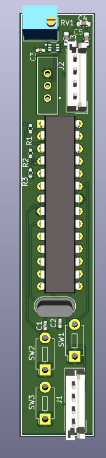

# 🖊️ Pen Mouse – A Wireless Pen-Style Mouse using ATmega328P

The **Pen Mouse** is a compact, pen-like input device that functions similarly to a traditional mouse. It uses an optical sensor to detect movement and buttons for left/right click functionality. Built using affordable and widely available components, this device is ideal for students, designers, and users with limited desk space—particularly during presentations or graphic design work.

---

## ✨ Features

- Move the cursor and perform clicks
- Pen-like ergonomic design for precise control
- Communicates wirelessly via Bluetooth
- Rechargeable and portable

---

## 🔩 Components Selection

- **ATmega328P-PU Microcontroller**  
  8-bit AVR RISC-based MCU with DIP-28 package for easy prototyping. Offers sufficient I/O, memory, and Arduino compatibility.

- **HC-06 Bluetooth Module (4-pin)**  
  Provides wireless connectivity. Simple UART interface, works with 3.3V or 5V logic.

- **TPS61023DRLT Switching Regulator**  
  Ensures stable 5V output from a Li-ion battery input, essential for reliable operation.

- **Li-ion Battery**  
  Rechargeable power source for portable use.

- **Arduino Uno**  
  Used for uploading firmware to the ATmega328P.

- **Passive Components (Resistors, Capacitors)**  
  For pull-ups, filtering, and power stabilization.

---
## 🛠️ Getting Started

### ⚙️ PCB Design

- The ATmega328P is placed centrally with decoupling capacitors near its power pins.
- SPI lines (MOSI, MISO, SCK, SS) are routed to the HC-06 Bluetooth module via pins 10–13 on the ATmega.
- A voltage regulation circuit using TPS61023DRLT generates a stable 5V from the Li-ion battery.

### 💻 Uploading Code to ATmega328P

1. Use an **Arduino Uno as ISP** to program the ATmega328P.
2. Follow this official Arduino tutorial for setup and connections:  
   🔗 [How to program ATmega328P using Arduino Uno – Arduino to Breadboard](https://docs.arduino.cc/built-in-examples/arduino-isp/ArduinoToBreadboard/)
3. Flash the Pen Mouse firmware (provided in the `codes/` folder).
4. After successful upload, remove the Arduino and power the Pen Mouse from the battery.

## 🖥️ Pen Mouse: Computer-Side Setup Guide (Windows/Linux/macOS)

This guide explains how to configure your computer to receive Pen Mouse input over Bluetooth and convert it into actual mouse movements using a Python script.

---

### 🔧 Prerequisites

- Python 3.6 or later
- Pip package manager
- HC-06 Bluetooth module paired with your system
- Basic code/text editor (e.g., Notepad++, VS Code, nano)

---

### 📦 Step 1: Install Required Python Packages

Open your terminal or command prompt and run:

```bash

pip install pyserial pyautogui
```
### 💾 Step 2: Create and Save the Python Script

1. Open any code or text editor.
2. Copy the provided Python code for Pen Mouse control (refer to the codes section).
3. Save the file as `pen_mouse.py`.

### 🔗 Step 3: Pair HC-06 and Find Serial Port

#### ✅ Windows
- Pair HC-06 from **Settings > Devices > Bluetooth**.
- Open **Device Manager > Ports (COM & LPT)** to find the COM port (e.g., `COM5`).

#### 🐧 Linux

```bash

bluetoothctl

scan on

pair XX:XX:XX:XX:XX:XX

trust XX:XX:XX:XX:XX:XX

connect XX:XX:XX:XX:XX:XX
```
```
ls /dev/rfcomm*
```
#### 🍎 macOS
- Pair HC-06 via **System Preferences > Bluetooth**.
- Locate the device in Terminal:

``bash

ls /dev/tty.HC-06*

### ▶️ Step 4: Run the Script

Run the following command in terminal or command prompt:

```bash

python pen_mouse.py
```
Once running, your Pen Mouse should control the system cursor via Bluetooth.

---

### ⚙️ Permissions and Troubleshooting

#### 🔒 Linux/macOS Serial Port Permissions

```bash

sudo chmod a+rw /dev/rfcomm0          # Linux

sudo chmod a+rw /dev/tty.HC-06-DevB   # macOS
```

#### 🍎 macOS Accessibility Permissions

- Go to **System Preferences > Security & Privacy > Accessibility**
- Add and allow your Terminal or Python environment to control your mouse
### 📚 References

- [PySerial Documentation](https://pyserial.readthedocs.io/)
- [PyAutoGUI Documentation](https://pyautogui.readthedocs.io/)


---

## 🖼️ Hardware Snapshots

### 📐 Schematic Diagram  


### 🛠️ PCB Layout  


### 🛠️ 3D PCB View  

---

## 📁 Repository Structure

PenMouse/  

├── kicad files/ # Schematic,BOM and PCB file 

├── images/ # Schematic and PCB images

├── datasheets/ # datasheet of components used

├── codes/ # code used for promgraming atmega and computer

├── Introduction # introduction and first idea of the project

├── PCB design # pcb design review

└── README.md


---

## 🚀 Future Improvements

- Add rechargeable support with USB charging
- Integrate gesture detection
- Replace HC-06 with BLE module for lower power and broader compatibility

---

## 📄 License

This project is licensed under the MIT License. See `LICENSE` file for details.

---

## 🤝 Contributing

Pull requests are welcome! For major changes, please open an issue first to discuss what you'd like to change.

---

## 🙌 Acknowledgements

- Inspired by DIY input devices and custom hardware projects
- Built at **IIT Hyderabad** as part of a ESDP Course Project

